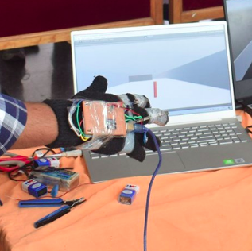
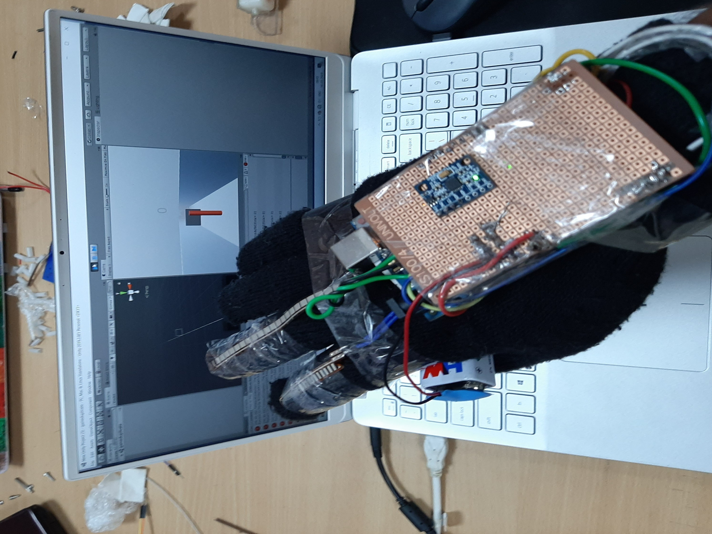

# Virtual_gaming_Electronics

## What is this?
Virtual Gaming is an project which interlinks our physical with digital world . [**XBOX**] .
In this we decided to make a such device which helps us in gaming so that you can feel that we are in gaming world. this project idea was actually taken form project form this site [**Cornell University Project**](https://people.ece.cornell.edu/land/courses/ece4760/FinalProjects/f2014/mht52_pb477_dma234/mht52_pb477_dma234/ECE%204760.html) in which they done similar to ours but they did it all on a microcontroller ATMega1284 . But we done it on arduino and unity.

## Video Link:

[**Click here to see the demo of the model**](https://drive.google.com/file/d/133msADb-vvlUbTtjuPj2xIkXZ4UIO2nn/)

## Aim of the Project?
The aim of this project is to control game with hand moments and gestures so that we can get a better experience of gamming. 

## What did we build this with?
It is done by using from MPU 6050 accelerometer for force and direction while flex sensors for gestures and Arduino for communicating with game with Bluetooth.

   
   

## Code in Repo:

This repo contains both Arduino code and unity game. by default, port was set to COM6 at 9600 baud rate you can change this in pin.cs located in assets folder

## Making:

Firstly, we need glove to make this and fix flex sensor to it. then make voltage divider with flex sensor and a resistor in series. connect resistor end to gnd and flex end to vcc. connect A0 of Arduino middle junction of voltage divider and take few readings when you close and open finger and estimate rough threshold value which can finely classify closing and opening of finger. change thresh vale in Arduino code with this.

Next place accelerometer in stable position of glove such that z axis is perpendicular to your glove(palm). connections to accelerometer are given in Arduino code.

Now connect Arduino to pc with wire or Bluetooth as your wish.

## Gaming:

First keep finger open to which sensor was attached then by rotating your hand you can set to which direction ball has to move and then close finger so that direction was fixed. While finger in closed position now try to place z perpendicular to ground and while moving your hand release finger so ball moves.

## Images of the project:

<!--  -->
